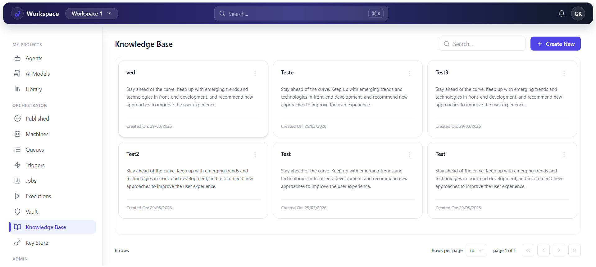
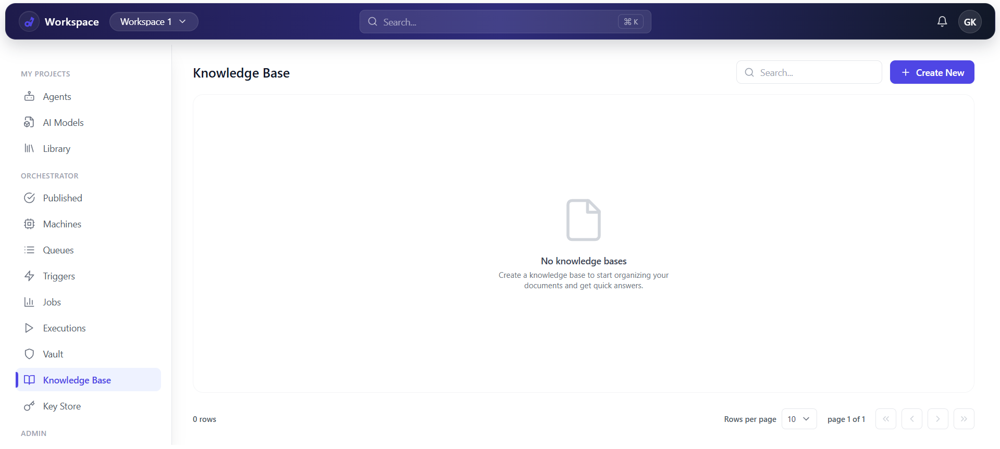
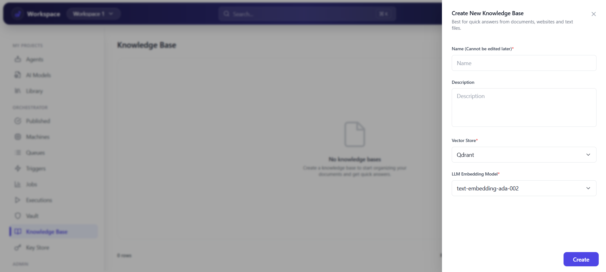
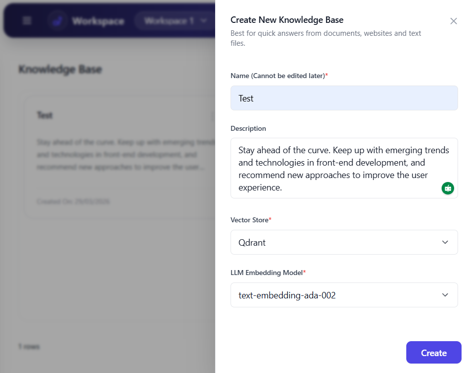
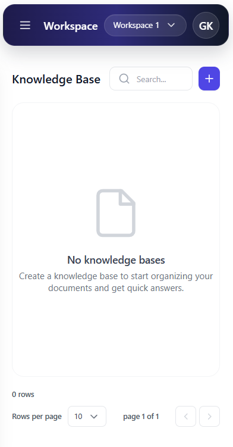
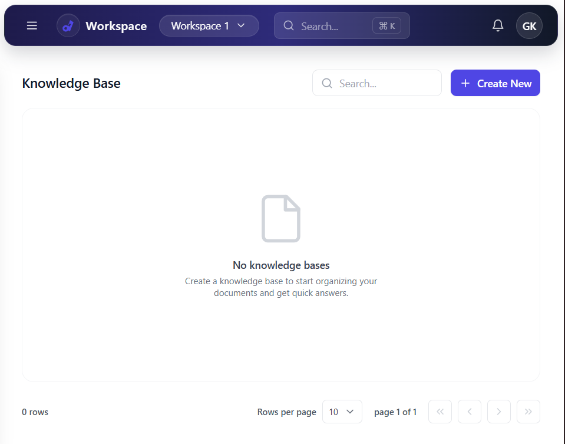

# Knowledge Base UI (React + Tailwind)

Responsive front-end built with **Vite + React + Tailwind CSS**, replicating a 2-screen Knowledge Base UI:
- **Home:** Knowledge Base listing (cards + pagination)
- **Create New:** Modal/Drawer to create a new Knowledge Base

**Design tokens**
- Primary: `#4F46E5`
- Secondary: `#1E1B4B`

## Screenshots
1) `knowledgebase_list`


2) `web_view`


3) `createmodal`


4) `createmodal2`


5) `mobile_view`


6) `tablet_view`


## Features
- Reusable components: `Header`, `Sidebar`, `MainContent`, `KBCard`, `CreateKBModal`, `Dropdown`
- Reusable animated `Dropdown` (workspace selector, rows-per-page, modal selects)
- Dynamic KB list (create -> appears instantly)
- Search by KB name
- 3-dot card menu actions: **Edit**, **Delete**, **Pin/Unpin**
- Pagination + Rows-per-page selection
- Fully responsive (mobile ~320px -> tablet -> desktop)
  - Off-canvas sidebar on mobile/tablet (toggle + overlay click-outside close)
  - Modal overlay (dim/blur) with mobile-friendly sizing

## Quick Start (Run Locally)
Prerequisites: **Node.js 18+** and **npm**

```bash
# clone the repo
git clone git@github.com:iamvpbhaskar/knowledgebase_aventisia.git
cd knowledgebase_aventisia

# install + run
npm install
npm run dev
```

Open: `http://localhost:5173/`

## Fork (GitHub)
1. Click **Fork** on GitHub
2. Clone your fork:
```bash
git clone git@github.com:<your-username>/knowledgebase_aventisia.git
cd knowledgebase_aventisia
```

## Build
```bash
npm run build
npm run preview
```

## Live Demo (Optional)
- GitHub Pages URL format: `https://<github-username>.github.io/<repo-name>/`

## Deploy - GitHub Pages
1. Push to GitHub (main branch).
2. In GitHub repo settings: **Settings -> Pages**
   - **Build and deployment:** select **GitHub Actions**
3. Wait for the workflow **Deploy to GitHub Pages** to finish.

## Deploy - Netlify
1. Netlify -> **Add new site -> Import an existing project**
2. Select your GitHub repo
3. Set:
   - **Build command:** `npm run build`
   - **Publish directory:** `dist`
4. Deploy

## Deploy - Vercel (Alternative)
1. Vercel -> **New Project** -> import GitHub repo
2. Framework preset: **Vite**
3. Build output: `dist`

## Project Structure
```
.
|-- index.html
|-- src/
|   |-- components/
|   |   |-- Sidebar.jsx
|   |   |-- Header.jsx
|   |   |-- MainContent.jsx
|   |   |-- KBCard.jsx
|   |   |-- CreateKBModal.jsx
|   |   `-- Dropdown.jsx
|   |-- App.jsx
|   |-- App.css
|   `-- main.jsx
|-- screenshots/
|-- assignment-plan.md
|-- package.json
|-- tailwind.config.js
|-- postcss.config.js
`-- vite.config.js
```

## Assignment Brief / Deliverables
See `assignment-plan.md`.
